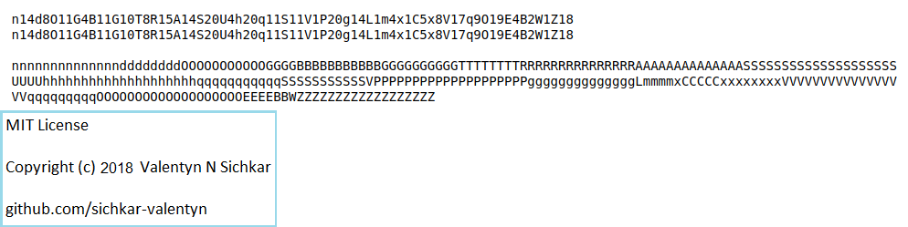

# Uncompressing the string using Set in Python
Uncompressing string by the rule a3 = aaa

### Reference to:
[1] Valentyn N Sichkar. Uncompressing the string using Set in Python // GitHub platform [Electronic resource]. URL: https://github.com/sichkar-valentyn/Uncompressing_the_string_using_Set_in_Python (date of access: XX.XX.XXXX)

## Description
Uncompressing the string from the file using Set with numbers and the rule a3 = aaa.

## Results

## MIT License
## Copyright (c) 2018 Valentyn N Sichkar
## github.com/sichkar-valentyn
### Reference to:
[1] Valentyn N Sichkar. Uncompressing the string using Set in Python // GitHub platform [Electronic resource]. URL: https://github.com/sichkar-valentyn/Uncompressing_the_string_using_Set_in_Python (date of access: XX.XX.XXXX)
